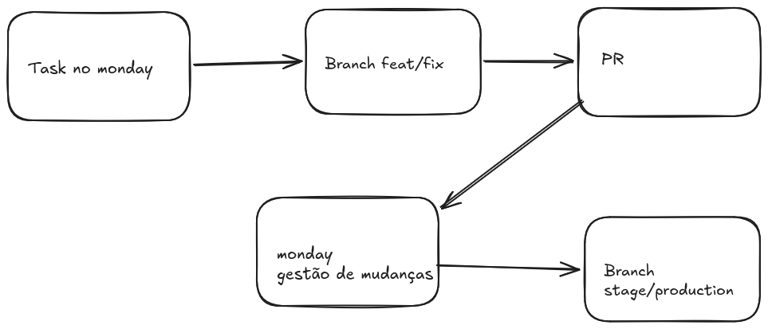

# Estrutura Organizacional

| Elemento    | Função                                         |
| ----------- | ---------------------------------------------- |
| Monday Task | Documento oficial de mudança (rastreabilidade) |
| Branch      | Implementação técnica                          |
| PR          | Revisão técnica da mudança                     |
| Release     | Entrega formal                                 |

---

## Rastreabilidade via Monday.com

O controle de mudanças é feito através dos IDs de **Board** e **Task** do Monday.

A URL de uma task segue o padrão:

```
https://vexur-company.monday.com/boards/[BOARD_ID]/pulses/[TASK_ID]
```

Os identificadores usados no fluxo são o **ID do Board** com prefixo `B` e o **ID da Task** com prefixo `T`:

```
B18399639420
T11318795000
```

---

## Como nomear a Branch

A branch sempre deriva da task do Monday.

- Formato:

```
tipo(ambiente-cliente)/B[BOARD_ID]-T[TASK_ID]-descricao-curta
```

- Exemplos:

```
feat(stage-cliente)/B18399639420-T11318795000-ajuste-calculo-comissao
feat(production-cliente)/B18399639420-T11318795000-ajuste-calculo-comissao
```

```
fix(stage-cliente)/B18399639420-T11318795000-validacao-cep-api
fix(production-cliente)/B18399639420-T11318795000-validacao-cep-api
```

### Tipos possíveis

- `feat`
- `fix`
- `hotfix`
- `improvement`
- `refactor`

---

## Como nomear a Pull Request

O título da PR deve identificar o cliente, referenciar os IDs do board e da task do Monday e ter uma descrição clara.

Utilizar campo de `Labels` para indicar o tipo de mudança (feature, bugfix, etc) e de qual ambiente se refere.

- Formato:

```
[CLIENTE] B[BOARD_ID] T[TASK_ID] - Descrição da mudança
```

- Exemplo:

```
[VEXUR] B18399639420 T11318795000 - Ajuste regra de cálculo comissão
```

- Conventional Commits:

```
feat([CLIENTE]/B[BOARD_ID]-T[TASK_ID]): descrição da mudança
```

- Exemplo:

```
feat(vexur/B18399639420-T11318795000): ajuste regra cálculo comissão
```

---

## Como conectar tudo

Na descrição da PR, sempre incluir o link direto para a task do Monday:

```
Ref: https://vexur-company.monday.com/boards/[BOARD_ID]/pulses/[TASK_ID]
```

Exemplo:

```
Implementa ajuste conforme task T11318795000 do board B18399639420.

Ref: https://vexur-company.monday.com/boards/18399639420/pulses/11318795000
```

---

## Exemplo Completo (Fluxo Real)

#### Cliente solicita mudança

Task criada no Monday:

```
Board: B18399639420
Task:  T11318795000 | Ajuste regra cálculo comissão
```

#### Desenvolvedor cria branch

```
feat(stage-cliente)/B18399639420-T11318795000-ajuste-calculo-comissao
feat(production-cliente)/B18399639420-T11318795000-ajuste-calculo-comissao
```

#### Desenvolvedor abre PR

Título:

```
[VEXUR] B18399639420 T11318795000 - Ajuste regra de cálculo comissão
```

Descrição:

```
Implementa ajuste conforme task T11318795000 do board B18399639420.

Ref: https://vexur-company.monday.com/boards/18399639420/pulses/11318795000
```

[[Voltar ao topo](#estrutura-organizacional)]

## Fluxo de PR


